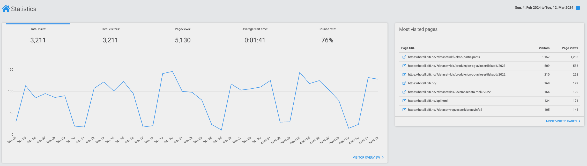

# Statistikk for Datahotellet — [hotell.difi.no](https://hotell.difi.no/)

## Rapporter

- [Trafikk-tal pr. datasett](stats_pr_dataset.html)
- [Trafikk-tal pr. organisasjon](stats_pr_org.html)

Desse to rapportene er basert på [besøkstal-datasettet](https://data.norge.no/datasets/d0cb26a7-7093-49f9-be1e-c7e9d6b7e473) og [Datahotellet sitt API](http://hotell.difi.no/api).
Besøkstal vert oppdatert i begynnelsen av kvar månad.

## Nettlesar-plugin

Det finst også ein uoffisiell nettlesar-plugin som brukar besøkstal-datasettet og viser graf og tabell for trafikk over tid for kvart datasett.

Sjå [post i Datalandsbyen](https://datalandsbyen.norge.no/topic/97/turbo-nettlesar-plugin-for-datahotellet) som har skjermbilder og lenker til å installere.

## Besøk på nettsidene hotell.difi.no

Vi brukar verktøyet Monsido for statistikk for trafikk på nettsidene.
På kvardagar er det 80–150 dagleg besøkande.

## Besøkstal på data.norge.no

Alle datasett i Datahotellet skal ha ei oppføring i data-katalogen på [data.norge.no](https://data.norge.no/).
Vi brukar Monsido for trafikk-tal, og har ikkje (endå) opplegg for å publisere detaljert statistikk.
Vi må difor manuelt hente ut tal på kor mange visningar dei enkelte beskrivelsane på data.norge har fått.

## Nginx-logg-undersøkingar

Rapporter frå undersøking av Nginx-serverloggar for 14-dagarsperiode.
- [ELMA 07.03.2024](elma_nginx.html)